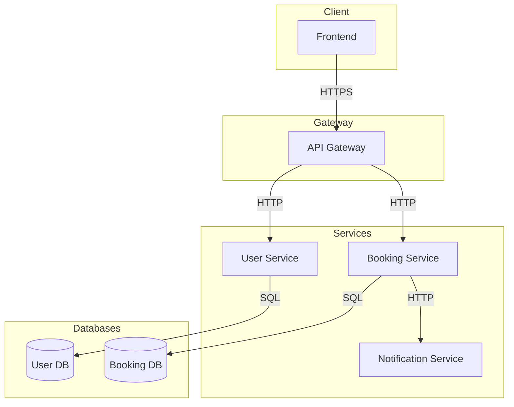
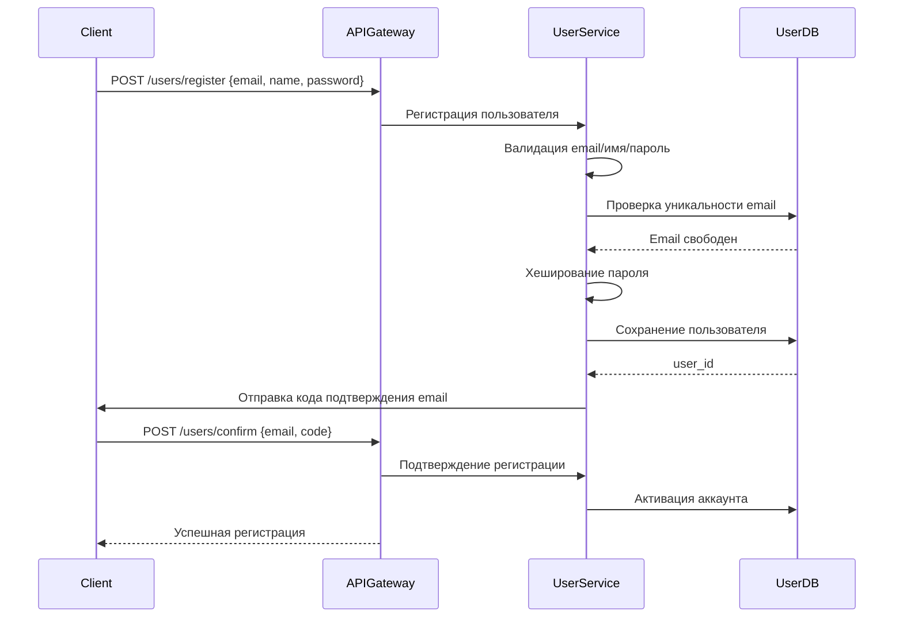
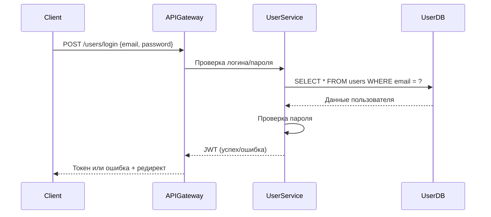
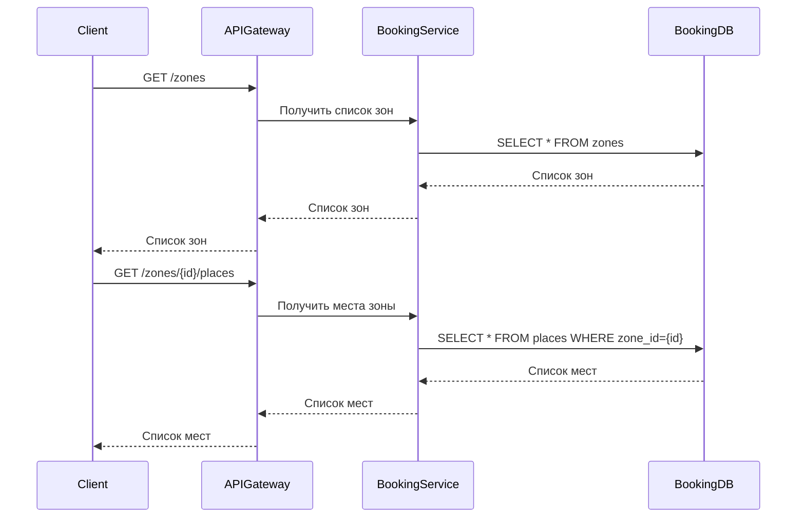
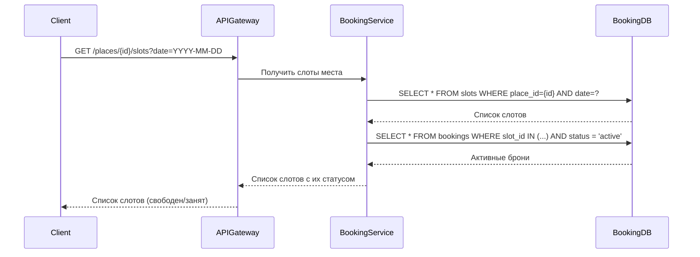
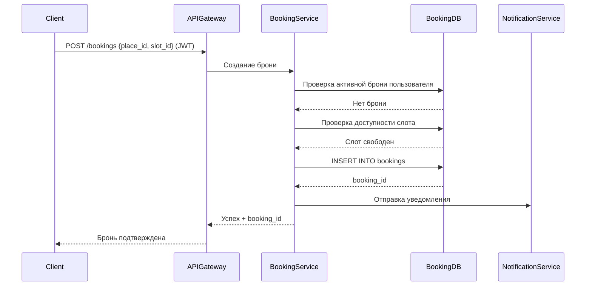
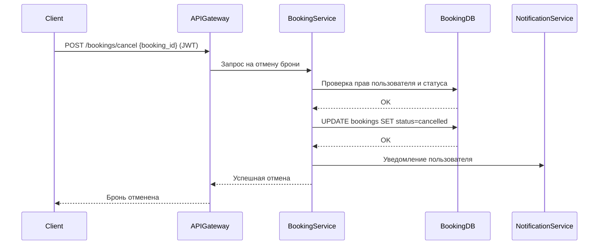
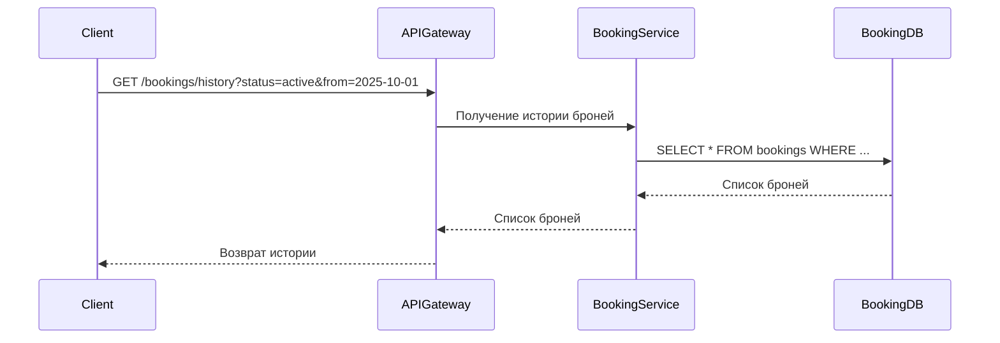
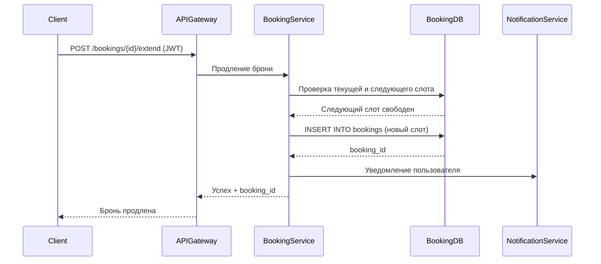
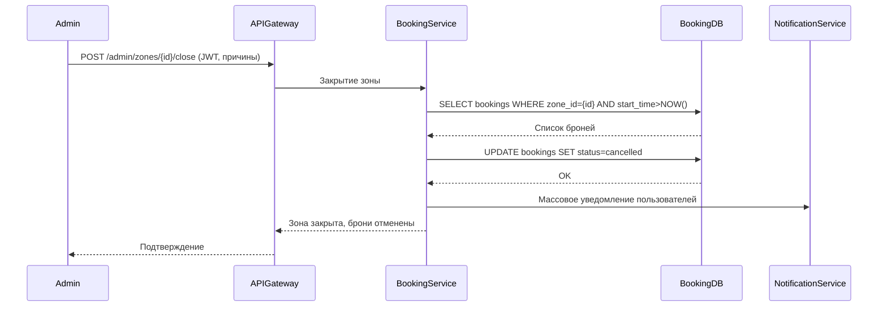

# Техническое решение проекта «Распределённая система бронирования мест в коворкингах кампуса»

## Введение

**Цель проекта**

Разработка распределённой системы онлайн‑бронирования рабочих мест в коворкингах кампуса, где пользователи могут регистрироваться, просматривать зоны и рабочие места с доступными временными слотами, оформлять и отменять бронирования и взаимодействовать с платформой через веб-интерфейс.

**Задачи**

1. Разработать систему регистрации и аутентификации пользователей.
2. Реализовать функционал просмотра зон и рабочих мест с отображением доступных слотов по дате и времени.
3. Создать функционал бронирования: оформление брони, отмена, продление и просмотр истории, гарантируя отсутствие двойных бронирований.
4. Построить отказоустойчивую и масштабируемую архитектуру (горизонтальное масштабирование сервисов, репликация БД) для обеспечения высокой доступности.
5. Обеспечить приемлемую производительность системы и надёжность: транзакционность операций, тестирование и CI/CD.

**Основания для разработки**  
Желание участников команды получить опыт в разработке распределённой системы  
Учебный проект по курсу "Распределённые системы"

| Участник | Роль |
|-------------|-------------|
| Шитов Иван | Team Lead, Fullstack-разработчик |
| Осипов Илья |  Fullstack-разработчик |
| Замышляев Роман |  Fullstack-разработчик |
| Гончаров Роман |  Fullstack-разработчик |

## Глоссарий

| Термин        | Описание |
|---------------|----------|
| Пользователь  | Зарегистрированный клиент системы бронирования |
| Зона          | Локация коворкинга, объединяющая рабочие места (например, конкретное общежитие) |
| Рабочее место | Физическое место, доступное для бронирования |
| Бронь         | Операция резервирования рабочего места на определённый слот времени |
| Слот времени  | Интервал для бронирования, кратный 60 минутам (например, 10:00–11:00 или 17:00–20:00) |
| История бронирования | Список всех активных и завершённых броней пользователя |

## Функциональные требования

### 1. Регистрация и аутентификация пользователей
- Пользователь должен иметь возможность зарегистрироваться, указав имя, email и пароль.
- После регистрации пользователь должен подтвердить email.
- Зарегистрированный пользователь должен иметь возможность войти в систему по email и паролю.
- В случае утраты пароля пользователь должен иметь возможность восстановить доступ через email.

### 2. Просмотр информации о коворкингах и рабочих местах
- Пользователь должен иметь возможность просматривать список всех зон коворкинга и видеть статус каждой зоны (открыта/на обслуживании).
- Пользователь должен иметь возможность просматривать список рабочих мест в выбранной зоне с их статусом (свободно/занято/на обслуживании).

### 3. Просмотр и выбор временных слотов
- Пользователь должен иметь возможность выбрать рабочее место и просмотреть доступные слоты на интересующую дату.
- Длина любого слота по времени не превышает 12 часов. 
- Для каждого слота должна отображаться информация о доступности (свободен/занят).

### 4. Оформление бронирования
- Пользователь должен иметь возможность забронировать свободный слот рабочего места.
- Система не должна допускать двойное бронирование одного рабочего места на один и тот же временной слот.
- Пользователь не должен иметь более одной активной брони на один и тот же временной слот.

### 5. Просмотр, отмена и продление бронирований
- Пользователь должен иметь возможность просматривать свои активные, завершённые и отменённые бронирования.
- Пользователь должен иметь возможность отменить свою активную бронь.
- Пользователь должен иметь возможность продлить свою бронь на следующий свободный слот при его наличии.

### 6. История бронирований
- Пользователь должен иметь возможность фильтровать историю бронирований по дате и зоне.

### 7. Уведомления
- Пользователь должен получать уведомления о создании, отмене или продлении бронирования, а также о важных событиях (например, закрытие зоны на обслуживание).
- Уведомления должны доставляться по email

### 8. Администрирование
- Администратор должен иметь возможность создавать, редактировать и удалять зоны коворкинга и рабочие места.
- Администратор должен иметь возможность закрывать зону на обслуживание с указанием причины и периода, при этом все будущие бронирования отменяются, а пользователи уведомляются.
- Администратор должен иметь возможность назначать и снимать менеджеров зон.
- Администратор должен иметь возможность отправлять массовые уведомления выбранным пользователям.

---

## Нефункциональные требования

| Требование         | Значение                                              |
|--------------------|------------------------------------------------------|
| Доступность        | ≥ 99.9%                                              |
| Время отклика      | ≤ 200 мс при 100 одновременных пользователях         |
| Отказоустойчивость | Работа при сбое любого одного узла                   |
| Консистентность    | Строгая: невозможны двойные/потерянные брони         |
| Безопасность       | Пароли в хешированном виде |
| Тестируемость      | 80% бизнес-логики покрыто юнит-тестами               |

---

##  Пользовательские сценарии

### Сценарий: регистрация нового пользователя
1. Пользователь вводит email, ФИО и пароль в форме регистрации.
2. Система отправляет код подтверждения на email.
3. Пользователь вводит код подтверждения.
4. Система создаёт аккаунт и авторизует пользователя (JWT).
5. Пользователь попадает в личный кабинет.

### Сценарий: вход в систему
1. Пользователь открывает форму входа и вводит email и пароль.
2. Система проверяет учётные данные.
3. При успехе система выдаёт сессию/JWT.
4. Пользователь перенаправляется на главную страницу.

### Сценарий: просмотр зон и рабочих мест
1. Пользователь открывает раздел «Зоны».
2. Система показывает список доступных зон с индикаторами занятости.
3. Пользователь выбирает зону.
4. Система отображает список рабочих мест выбранной зоны.

### Сценарий: просмотр доступности слотов
1. Пользователь открывает страницу конкретного рабочего места.
2. Выбирает дату (календарь).
3. Система показывает часовые слоты со статусом «свободно/занято».
4. Пользователь при необходимости применяет фильтр по времени.

### Сценарий: бронирование места
1. Пользователь выбирает свободный слот.
2. Нажимает «Забронировать».
3. Система проверяет доступность и отсутствие конфликтующей брони пользователя.
4. Система создаёт бронь и показывает подтверждение.
5. Бронь появляется в разделе «Мои бронирования».

### Сценарий: отмена бронирования
1. Пользователь открывает «Мои бронирования».
2. Выбирает активную бронь и нажимает «Отменить».
3. Система проверяет права и статус.
4. Система меняет статус на «отменена» и освобождает слот.
5. Пользователь видит обновлённый список броней.

### Сценарий: просмотр истории бронирований
1. Пользователь открывает «История бронирований».
2. Система отображает завершённые и отменённые брони.
3. Пользователь при необходимости применяет фильтры (дата, зона, статус).
4. Система обновляет список по выбранным критериям.

### Сценарий: продление бронирования
1. Пользователь открывает карточку активной брони.
2. Нажимает «Продлить» на следующий час.
3. Система проверяет доступность следующего слота.
4. При успехе создаётся новая бронь и отображается подтверждение.

### Сценарий: закрытие зоны на обслуживание (admin)

1. Администратор выбирает зону и инициирует её закрытие на обслуживание.
2. Указывает причину и временной интервал закрытия.
3. Система отменяет все будущие бронирования в этой зоне.
4. Система уведомляет всех затронутых пользователей.
5. Администратор получает подтверждение операции.

##  Архитектура системы

### Компоненты

- **API Gateway (FastAPI)**
  - Маршрутизирует все клиентские запросы
  - Выполняет базовую аутентификацию

- **User Service (FastAPI)**
  - Управляет регистрацией, аутентификацией, хранит пользователей
  - Таблица: `users` (id, name, hashed_password, created_at)

- **Booking Service (FastAPI)**
  - Обрабатывает логику бронирования, отмены, историю, управление зонами и рабочими местами, выполнение админских операций (админ-функции реализованы через проверку ролей)
  - Таблицы: `zones`, `places`, `slots`, `bookings`
    - `zones` (id, name, address, places_count)
    - `places` (id, zone_id, name)
    - `slots` (id, place_id, start_time, end_time)
    - `bookings` (id, user_id, slot_id, status: active/cancelled, created_at)

- **Notification Service (опционально, FastAPI)**
  - Отправляет email/push-уведомления о подтверждении/отмене брони

- **PostgreSQL**
  - Хранит все данные системы, отдельные схемы для пользователей и бронирований

- **Frontend (Next.js/React, вне текущей архитектуры, взаимодействует через API Gateway)**

---

## Технические сценарии

### Сценарий: регистрация нового пользователя

1. Клиент отправляет в API Gateway запрос POST /users/register с email, ФИО и паролем
2. API Gateway перенаправляет запрос в User Service
3. User Service валидирует email, проверяет уникальность
4. User Service хеширует пароль и сохраняет пользователя в User DB
5. User Service отправляет код подтверждения на email пользователя
6. Пользователь вводит код подтверждения, система активирует аккаунт
7. API Gateway возвращает клиенту статус успешной регистрации

### Сценарий: вход в систему

1. Клиент отправляет в API Gateway запрос POST /users/login с email и паролем.
2. API Gateway перенаправляет запрос в User Service.
3. User Service проверяет валидность email и пароля по данным в User DB.
4. При успешной проверке User Service генерирует JWT токен.
5. API Gateway возвращает токен клиенту, клиент перенаправляется на главную страницу.

---

### Сценарий: просмотр зон и рабочих мест

1. Клиент отправляет GET /zones через API Gateway.
2. API Gateway перенаправляет запрос в Booking Service.
3. Booking Service запрашивает список зон и их статусы из Booking DB.
4. API Gateway возвращает список зон клиенту.
5. Клиент отправляет GET /zones/{id}/places для выбранной зоны.
6. API Gateway перенаправляет запрос в Booking Service.
7. Booking Service возвращает список рабочих мест по зоне из Booking DB.

---

### Сценарий: просмотр доступности слотов

1. Клиент отправляет GET /places/{id}/slots?date=YYYY-MM-DD через API Gateway.
2. API Gateway перенаправляет запрос в Booking Service.
3. Booking Service запрашивает слоты по месту и дате из Booking DB.
4. Booking Service определяет статус каждого слота (свободен/занят).
5. API Gateway возвращает список слотов с их статусом клиенту.

---

### Сценарий: создание брони рабочего места

1. Клиент отправляет POST /bookings с JWT токеном, id места и слота
2. API Gateway валидирует токен и перенаправляет запрос в Booking Service
3. Booking Service проверяет наличие активной брони пользователя на этот слот
4. Booking Service проверяет доступность слота (нет других броней)
5. При успехе Booking Service сохраняет запись о бронировании в Booking DB
6. Booking Service отправляет уведомление пользователю через Notification Service
7. API Gateway возвращает подтверждение и booking_id клиенту

---

### Сценарий: отмена бронирования

1. Клиент отправляет POST /bookings/cancel с JWT токеном и booking_id
2. API Gateway валидирует токен и перенаправляет запрос в Booking Service
3. Booking Service проверяет права пользователя и статус брони
4. Booking Service обновляет статус бронирования в базе данных
5. Booking Service отправляет уведомление пользователю через Notification Service
6. API Gateway возвращает подтверждение отмены

---

### Сценарий: просмотр истории бронирований

1. Клиент отправляет GET /bookings/history с JWT токеном и фильтрами
2. API Gateway валидирует токен и перенаправляет запрос в Booking Service
3. Booking Service формирует SQL-запрос с фильтрами (дата, зона, статус)
4. Booking Service получает список из Booking DB
5. API Gateway возвращает список броней клиенту

---

### Сценарий: продление бронирования

1. Клиент отправляет POST /bookings/{id}/extend с JWT токеном
2. API Gateway валидирует токен и перенаправляет запрос в Booking Service
3. Booking Service проверяет права пользователя и доступность следующего слота
4. При успехе создаёт новую бронь на следующий слот
5. Booking Service отправляет уведомление пользователю через Notification Service
6. API Gateway возвращает подтверждение клиенту

---

### Сценарий: закрытие зоны на обслуживание (admin)

1. Админ отправляет POST /admin/zones/{id}/close с JWT токеном и причинами через API Gateway в Booking Service
2. Booking Service определяет будущие брони в зоне.
3. Booking Service отменяет все будущие бронирования и уведомляет пользователей через Notification Service.
4. API Gateway возвращает подтверждение администратору.

---

## План разработки и тестирования

### MVP (Минимально жизнеспособный продукт)

**Требования для MVP:**

- Реализация User Service (регистрация, аутентификация)
- Реализация Booking Service (просмотр зон, рабочих мест, слотов; создание/отмена/продление/история бронирований; функции администрирования реализуются в Booking Service через проверку ролей)
- Реализация Notification Service (email, push, внутренняя лента)
- Интеграция с PostgreSQL (отдельные схемы для пользователей и бронирований)
- Реализация API Gateway для маршрутизации и управления запросами
- Реализация фронтенда (Next.js/React) для работы всего функционала
- Учтена возможность горизонтального масштабирования сервисов

**План разработки:**
1. Проектирование API (OpenAPI-спецификация) для всех сервисов
2. Реализация API Gateway с маршрутизацией и базовой аутентификацией
3. Реализация User Service (регистрация, логин, JWT)
4. Реализация Booking Service (CRUD зон/мест/слотов, создание/отмена/продление брони, история, все админ-функции)
5. Реализация Notification Service (email, push, внутренняя лента)
6. Настройка PostgreSQL, проектирование схемы данных, миграции
7. Интеграция сервисов с БД и очередями
8. Разработка фронтенда (Next.js): регистрация, просмотр зон/мест, создание/отмена/продление брони, админ-интерфейс
9. Разработка документации API и пользовательских сценариев

**План тестирования:**
- Модульные тесты бизнес-логики сервисов (User, Booking, Notification)
- Интеграционные тесты взаимодействия сервисов и API Gateway
- Тесты API Gateway (валидные/невалидные запросы, маршрутизация)
- Тесты транзакционности и конкурентности (одновременные бронирования, блокировки)
- Тесты edge-cases (дублирование email, конфликт слотов, права доступа)
- Проверка восстановления пароля, отмены и продления брони
- Тесты фронтенда (автоматические сценарии регистрации, бронирования, отмены)

**Definition of Done (DoD) для MVP:**
- Пользователь может зарегистрироваться, войти, восстановить пароль
- Можно просматривать зоны, рабочие места, слоты; создавать, отменять, продлевать брони
- Админ может управлять зонами, местами, закрывать зоны, отправлять массовые уведомления (через Booking Service, роль "admin")
- Уведомления доставляются пользователям (email / push)
- 80% кода покрыто тестами

---

### Расширенный проект (Advanced Scope)

**Включает:**
- Реализация аналитики (heatmap, отчёты по занятости)
- Репликация БД
- Кэширование (Redis) для ускорения получения доступности мест

**План разработки:**
1. Реализация аналитики и heatmap (Booking Service и фронтенд)
2. Репликация PostgreSQL, балансировка нагрузки
3. Реализация Redis для кэширования и повышения производительности

**План тестирования:**
- Тесты аналитики и heatmap
- Тесты отказоустойчивости (имитация сбоев сервисов/узлов)
- Нагрузочное тестирование (100+ одновременных пользователей)
- Тесты кэширования и производительности
- Тесты масштабируемости (расширение зон/мест)

**Definition of Done (DoD) для расширенного проекта:**
- Реализована аналитика и heatmap
- Система масштабируется горизонтально
- Система отказоустойчива (работает при отказе любого сервиса/узла)
- 80% кода покрыто тестами
- Высокая производительность при нагрузке (отклик <200 мс при 100+ пользователях)

---